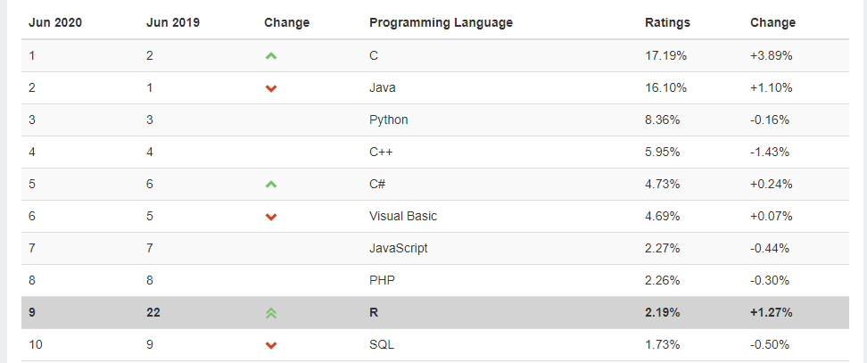

```{r setup, include=FALSE}
options(htmltools.dir.version = FALSE)
library(tidyverse)
```

```{r xaringan-themer, include=FALSE}
library(xaringanthemer)
style_mono_light(
  base_color = "#26116c",
  text_bold_color = "#fd5e53",
  title_slide_text_color = "#fff8e7",
  background_color = "#fff8e7",
  header_font_google = google_font("Roboto"),
  text_font_google   = google_font("Roboto Condensed"),
  code_font_google   = google_font("Droid Mono")
)
```

class: center, middle

# What is R?

---
# What is R?

**R** is a programming language designed originally for *statistical analyses*.

--

**R** was created by **Ross Ihaka** and **Robert Gentleman** in 1993.

_(Their names are why it's called **R**, which is also a joke about the predecessor
being called **S**.)_

--

**R** was formally released by the **R Core Group** in 1997.

[https://www.r-project.org/contributors.html](https://www.r-project.org/contributors.html)


This group of 20-ish volunteers are the *only* people who can change the **base** 
(built-in) functionality of **R**.

---
# What is python?

**python** is a **general-purpose** programming language, that is popular in everything from web development to data science.

--

**python** was created in 1981 by Guido van Rossum

--

It was designed to emphasize code readability and clarity.

---
# R and python are popular and growing!



---
# Strengths


**R**'s **strengths** are...

--

... handling data with lots of **different types** of variables.

--

... making nice and complex data **visualizations**.

--

... having cutting-edge statistical **methods** available to users.

---
# Strengths


**python**'s **strengths** are...

--

... more **efficient computation**, especially of big data.

--

... **general purpose** use that goes beyond statistics/data science.

--

... more strict **computer science principles**.


---
class: center, middle, invert

# But wait!


---
# Packages

The heart and soul of **R** and **python** are **packages** (sometimes called "libraries").

--

These are "extra" sets of code that add **new functionality** when installed.

--

"Official" **R** packages live on the *Comprehensive R Archive 
Network*, or **CRAN**

--

"Official" **python** packages live on the *Python Package Index*, or **PyPi**

---

# Open-Source

Importantly, **R** and **python** are *open-source*.

--

There is no company that owns these languages, like there is for *SAS* or *Matlab*.


--

This means nobody can sell their **R** or **python** code!

--

* (but you can sell "helpers" like **RStudio** and **Anaconda**)

--

* (and you can keep code **private** within an organization or company)

--

**Packages are created by users like you and me!**

---
# Open Source

Being a good open-source citizen means...

--

... **sharing** your code publicly when possible. 

(I encourage you to use *GitHub*!)

--

... **contributing** to public projects and packages, as you are able.

--

... creating your own **packages**, if you can.

--

... using coding tools for **ethical and respectful** projects.

---

class: center, middle, inverse

# Intro to RStudio

---

class: center, middle

# What is RStudio?

---
# What is RStudio?

**RStudio** is an IDE (*Integrated Developer Environment*).

This means it is an application that makes it easier for you to interact with **R** and **python**.

--


---
# History of RStudio

**RStudio** was released in 2011 by J.J. Allaire.

--

Recall: You can __not__ sell __R__ code; packages created by RStudio's team are freely available.  

They make money off the IDE and other helper software.


---


---
class: center, middle

# Let's try it!

---
class: center, middle, inverse

# Intro to R Markdown

---

# What is Markdown?

**Markdown** (without the "R") is a *markup language*.  This means special symbols and formatting to pretty documents.

--

Markdown files have the **.md** extension.

---


---
# What is R Markdown?

**R Markdown** (with the "R") uses regular markdown, plus it can run and display **R** and **python** code.

--

R Markdown files have the **.Rmd** extension.

---


---


---
# Knitting

To convert your R Markdown file to a beautiful document, click **Knit**.


---
# Knitting

You do **not** have to knit a file to *save* it!!!

Do this the regular way:

- `Ctrl/Cmd + S`

- Click the Floppy Disk icon

- Click "File > Save As"

--

As you work, you should **save** extremely frequently and **knit** semi-regularly.

---
# Knitting

When you click **knit**, here is what happens:

--

- Your file is saved.

--

- The R code written in your *.Rmd* file gets run.

    + Any code you ran already doesn't "count"; we start from scratch.
    + The code is run *in order*.

--

- A new file is created.

    + If your R Markdown file is called "Lab1.Rmd", then a file called "Lab1.html" will be created.
    + This will save in the same folder as "Lab1.Rmd".
    
---

class: center, middle, invert

# Let's try it!
